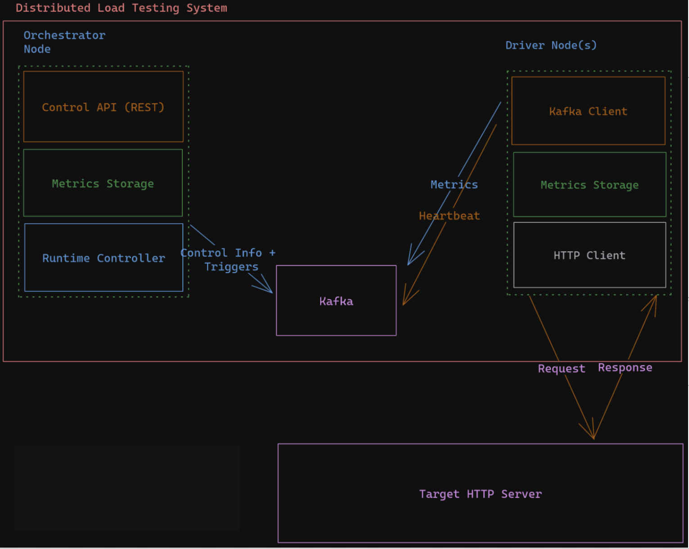

# Kafka-Based Load Testing System

## Overview

This system is designed to perform load testing on a target HTTP server using Apache Kafka for communication between nodes. It includes an Orchestrator Node, Driver Nodes, and a Target HTTP Server. The system supports two types of load testing: Tsunami and Avalanche testing. It is scalable, observable, and ensures that metrics are collected and reported efficiently.

## Components

### Orchestrator Node

The Orchestrator Node is responsible for coordinating and managing the load testing process. It includes the following features:

- **REST API**: Provides endpoints to view and control different tests, trigger load tests, and report statistics for ongoing tests.
- **Runtime Controller**: 
  - Handles heartbeats from Driver Nodes to manage their connectivity.
  - Coordinates between Driver Nodes to start and manage load tests.
  - Receives metrics from Driver Nodes and stores them in the metrics store.
- **Metrics Store**: Aggregates metrics from all Driver Nodes, including response latencies and request counts.

### Driver Node

The Driver Node performs the actual load testing by sending requests to the target HTTP server. It includes the following features:

- **Request Sending**: Sends requests to the target webserver as instructed by the Orchestrator Node.
- **Statistics Collection**: Records statistics for request response times, including mean, median, min, and max latencies.
- **Metrics Reporting**: Sends collected metrics back to the Orchestrator Node.
- **Communication Layer**: Implements Kafka Client to communicate with the central Kafka instance.

### Target HTTP Server

The Target HTTP Server provides endpoints for testing and metrics collection:

- **/ping**: An endpoint for performing load tests.
- **/metrics**: Provides metrics about the number of requests received and responses sent.

## Load Testing Types

### Tsunami Testing

- **Delay Interval**: Allows the user to set a delay interval between each request. The system ensures that this gap is maintained on each node during testing.

### Avalanche Testing

- **Immediate Requests**: All requests are sent as soon as they are ready, processed in a first-come, first-serve manner.

## Configuration

- **Command-Line Arguments**: All nodes take the Kafka IP Address and the Orchestrator node IP Address as command-line arguments.
- **Unique IDs**: Each node has a unique ID for registration and can generate unique IDs as needed.
- **Target Throughput**: The user specifies the target throughput (requests per second) and the total number of requests per driver node.
- **Test Termination**: Tests stop once all responses for the specified number of requests are received.

## Observability

- **Request Tracking**: The Orchestrator Node tracks how many requests each Driver Node has sent, updated every second.
- **Dashboard**: Provides a dashboard showing aggregated metrics including min, max, mean, median, and mode response latency across all Driver Nodes.
- **Metrics Store**: Both the Orchestrator and Driver Nodes maintain a metrics store for recording and accessing testing metrics.

## Scalability

- **Node Configuration**: Supports a minimum of three nodes (one Orchestrator and two Driver Nodes) and a maximum of nine nodes (one Orchestrator and eight Driver Nodes).
- **Dynamic Scaling**: Allows changing the number of Driver Nodes between tests.

## Implementation

### Proposed Architecture



### Orchestrator Node

```python
# Example code snippet for the Orchestrator Node
from flask import Flask, request
import kafka

app = Flask(__name__)

@app.route('/start-test', methods=['POST'])
def start_test():
    # Code to trigger a load test
    pass

@app.route('/report-stats', methods=['GET'])
def report_stats():
    # Code to report statistics
    pass

if __name__ == "__main__":
    app.run(port=5000)
